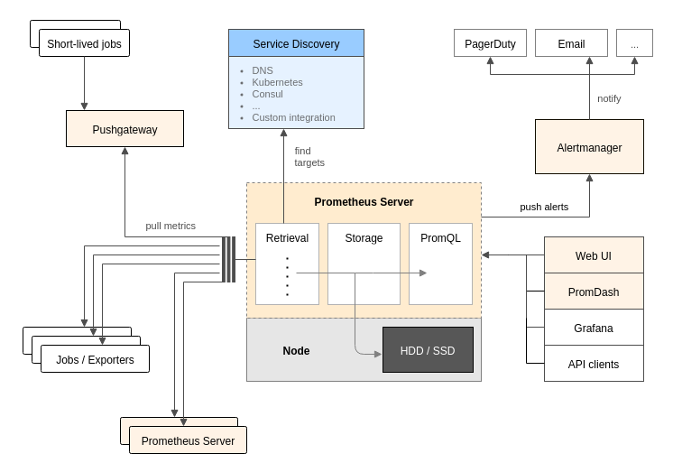
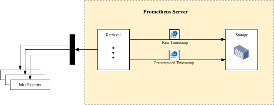

# Belajar Prometheus

Prometheus adalah alat monitoring open source yang bekerja dengan cara mengumpulkan data metric dari node/db/app/dll dalam interval tertentu. prometheus dapat menampilakan data dalam bentuk grafik, mentrigger alert, & menyediakan query language untuk pengambilan data.


### Architecture


### Prometheus Service

#### Komponen
Prometheus Servert memiliki 3 komponen yaitu :
1) Retrieval
retrieval adalah komponen yang bertugas mengumpulkan data metric dari berbagai sumber. sumber data bisa dari server prometheus sendiri, exporter, push gateway, service discovery ataupun aplikasi apapun yang telah mengexpose data metric pada url /metric. untuk detail silakan klik link berikut [baca....](retrieval.md)

3) Storage
storage adalah penyimpanan data dari prometheus

5) PromQL
promQL adalah query language dari prometheus yang digunakan untuk menampilkan data sesuai kebutuhan.

#### Config File
config file adalah file konfigurasi dari prometeheus yang berisi bbrp konfigurasi yaitu global config, rules, alert & scrape. konfigurasi ditulis dalam formal yaml. untuk detail silakan klik link berikut [baca....](configfile.md)

### Rules
Prometheus memiliki 2 jenis rules yaitu recording rules & alerting rules. kedua rules tadi dapat di set dalam 1 file yang sama & di evaluasi oleh prometheus dalam interval tertentu, mengikuti global config 
```yml
global:
  evaluation_interval: 15s
```

**Recording Rules**

Recording rules adalah precomputed timestamp hasil dari sebuah query. untuk lebih jelas, coba perhatikan contoh rules dibawah

```yaml
groups:
  - name: myrules
    rules:
      - record: job:prometheus_http_requests:avg
        expr: avg by(job) (rate(prometheus_http_requests_total[5m]))
```

dalam contoh diatas terdapat 1 rules dengan nama `job:prometheus_http_requests:avg` dan query untuk mencari rata2 rate request prometheus dalam 5 menit. query tersebut nantinya akan bisa digunakan cukup dengan menuliskan nama dari rules & akan mereturn value yang sama dengan query diatas.

jika dilihat sekilas, recording rules mirip alias. tapi recoding rules bukanlah alias melainkan precomputed timestamp. atau dengan kata lain, value yang dikeluarkan oleh rules diatas adalah data yang sudah disimpan oleh prometheus sebagai timestamp baru. 



pada proses digambar diatas, prometheus akan menyimpan timestamp dari target & memproses precomputed timestamp berdasarkan rules & disimpan di storage yang sama.

#### Contoh
1) Setup On VM [open](setup_on_vm)
2) Setup On Docker Compose [open](setup_on_docker_compose)
3) Setup On Kubernetes [open](setup_on_kubernetes)
4) Setup MongoDB Expoter On Kubernetes [open](setup_mongodb_exporter_on_kubernetes)
5) Simple Alerting [open](simple_alerting)
6) Simple Alerting with Alert Manager [open](simple_alerting_with_alertmanager)
