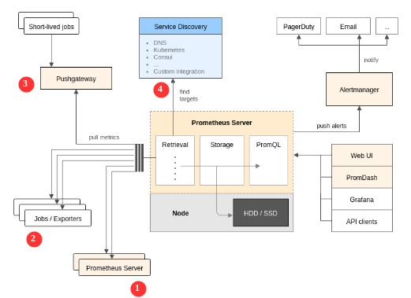

#### Retrieval
retrieval adalah komponen yang bertugas mengumpulkan data metric dari berbagai sumber. sumber data bisa dari server prometheus sendiri, exporter, push gateway, service discovery ataupun aplikasi apapun yang telah mengexpose data metric pada url /metric.

