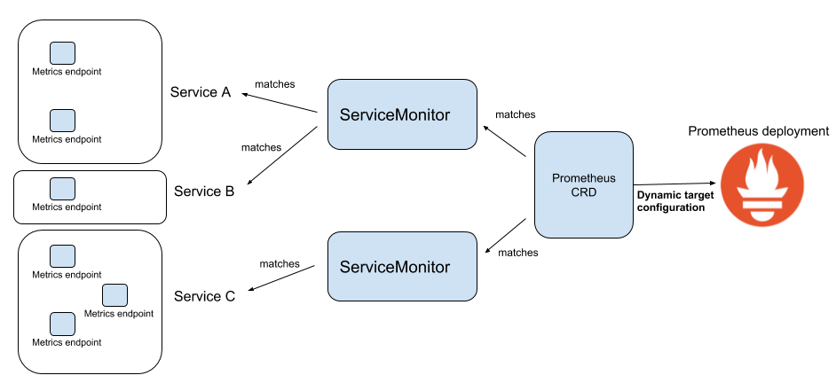

# Setup Prometheus on Kubernetes

installasi/setup prometheus di kubernetes menggunakan helm

#### Setup
terdapat beberapa komponen yang di install ketika melakukan installasi menggunakan helm
1) Prometheus Deployment
2) Service Monitor
service monitor adalah custom komponen di k8s (crd) yang bertugas menscrape target prometheus
3) Prometheus Rule
prometheus rule ada custom komponen di k8s (crd) yang berisi rules prometheus (custom query, alert rule dll)
4) Alert Manager Deployment
6) Beberapa Exporter Bawaan
5) Grafana + beberapa dashboard

#### Proses Pengumpulan Data Metric Prometheus dalam Kubernetes

#### Note !
untuk menjalankan run.sh pastikan telah
1) menginstall helm